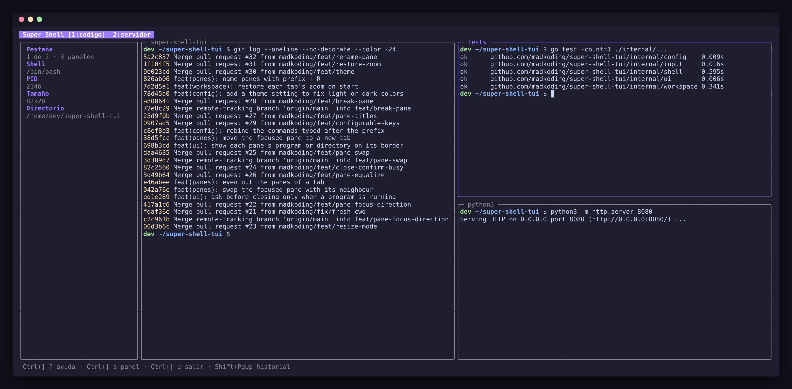

# Super Shell TUI

TUI en Go (Bubble Tea) que embebe un shell interactivo en un panel. Las teclas
se envían **en bruto** al PTY, así que el autocompletado (Tab), el historial
(↑/↓) y la búsqueda inversa (Ctrl+R) de bash funcionan igual que en una
terminal normal. Organiza varios shells en pestañas y paneles, con un panel
lateral de información y la sesión guardada al salir.



*Pestaña `código` con tres paneles: `git log`, uno renombrado `tests` y un
servidor cuyo borde muestra el programa que corre (`python3`).*

## Instalación

Binarios para Linux y macOS (amd64 y arm64) en
[Releases](https://github.com/madkoding/super-shell-tui/releases):

```sh
# ejemplo: Linux amd64 (reemplaza VERSION, p. ej. 0.1.0)
curl -sSL https://github.com/madkoding/super-shell-tui/releases/download/vVERSION/super-shell_VERSION_linux_amd64.tar.gz | tar -xz super-shell
sudo mv super-shell /usr/local/bin/
```

Con Go instalado:

```sh
go install github.com/madkoding/super-shell-tui@latest   # instala el binario como super-shell-tui
```

Para publicar una versión: `git tag v0.1.0 && git push origin v0.1.0`; el
workflow de release compila y sube los binarios con GoReleaser.

## Uso

```sh
go build -o super-shell .
./super-shell              # usa $SHELL o /bin/bash
./super-shell -shell /bin/zsh
```

Funciona en Linux y macOS. En macOS el directorio de cada pestaña se obtiene
con `lsof`, que viene con el sistema.

## Configuración

Archivo TOML en `~/.config/super-shell/config.toml` (Linux) o
`~/Library/Application Support/super-shell/config.toml` (macOS):

```sh
super-shell -init-config          # crea el archivo comentado con los valores por defecto
super-shell -config otra.toml     # usa otro archivo
```

| Clave           | Por defecto | Descripción                                      |
|-----------------|-------------|--------------------------------------------------|
| `shell`         | `$SHELL`    | Shell a ejecutar (`-shell` lo sobrescribe)       |
| `prefix`        | `ctrl+]`    | Prefijo: `ctrl+a`…`ctrl+z`, `ctrl+\`, `ctrl+]`, `ctrl+^`, `ctrl+_` |
| `sidebar`       | `true`      | Mostrar el panel lateral al iniciar              |
| `sidebar_width` | `30`        | Ancho del panel lateral (16-80)                  |
| `scrollback`    | `10000`     | Líneas de historial por shell (1-100000)         |
| `restore_tabs`  | `true`      | Reabrir las pestañas de la sesión anterior       |
| `restore_command` | `type`    | Programa que corría cada pestaña al salir: `type` lo deja escrito, `run` lo ejecuta, `off` lo ignora |
| `theme`         | `auto`      | Colores por defecto: `auto` (según el fondo de la terminal), `light` o `dark` |
| `colors.accent` | adaptativo  | Color principal en hex (`#9D7CFF`)               |
| `colors.muted`  | adaptativo  | Color secundario en hex                          |
| `keys.<acción>` | —         | Otra tecla para un comando, p. ej. `split_right = "v"` (ver abajo) |

Un valor inválido o una clave desconocida detienen el arranque con un error
que indica el archivo y la clave.

## Atajos (prefijo `Ctrl+]`, configurable)

| Tecla        | Acción                       |
|--------------|------------------------------|
| `Ctrl+] ?`   | Mostrar/ocultar ayuda        |
| `Ctrl+] s`   | Mostrar/ocultar panel lateral|
| `Ctrl+] q`   | Salir                        |
| `Ctrl+] c`   | Nueva pestaña de shell       |
| `Ctrl+] n` / `Ctrl+] p` | Pestaña siguiente / anterior |
| `Ctrl+] 1`…`9` | Ir a la pestaña N          |
| `Ctrl+] r`   | Renombrar la pestaña (Enter guarda, Esc cancela, vacío = automático) |
| `Ctrl+] R`   | Renombrar el panel activo (se ve en su borde y se guarda al salir) |
| `Ctrl+] x`   | Cerrar el panel, o la pestaña si tiene uno solo (si hay un programa corriendo pide confirmación con `y`) |
| `Ctrl+] \|` / `Ctrl+] %` | Dividir el panel a la derecha |
| `Ctrl+] -` / `Ctrl+] "` | Dividir el panel hacia abajo |
| `Ctrl+] o`   | Siguiente panel              |
| `Ctrl+] h` `j` `k` `l` | Ir al panel de la izquierda, abajo, arriba o derecha |
| `Ctrl+] ←↑→↓` (o `H` `J` `K` `L`) | Mover el borde del panel activo |
| `Ctrl+] {` / `Ctrl+] }` | Intercambiar el panel con el anterior / siguiente |
| `Ctrl+] =`   | Repartir el área en paneles del mismo tamaño |
| `Ctrl+] !`   | Mover el panel activo a una pestaña nueva |
| `Ctrl+] z`   | Zoom: el panel activo ocupa toda el área (otra vez para volver) |
| `Ctrl+] /`   | Buscar en el historial       |
| `Ctrl+] Ctrl+]` | Enviar `Ctrl+]` al shell  |

Las teclas después del prefijo se cambian en la sección `[keys]` del config:

```toml
[keys]
split_right = "v"   # Ctrl+] v divide a la derecha (reemplaza | y %)
split_down = "b"
```

Acciones: `quit`, `toggle_sidebar`, `help`, `new_tab`, `next_tab`,
`prev_tab`, `rename_tab`, `rename_pane`, `close`, `search`, `split_right`, `split_down`,
`next_pane`, `zoom`, `break_pane`, `equalize`, `swap_next`, `swap_prev`, `focus_left`,
`focus_down`, `focus_up`, `focus_right`. Los dígitos y `H` `J` `K` `L` están
reservados; la ayuda (`?`) muestra las teclas configuradas.

Cualquier otra tecla va directo al shell.

## Panel lateral

`Ctrl+] s` lo muestra u oculta. Indica la pestaña activa y cuántos paneles
tiene, y del panel activo el shell, su PID, el tamaño y el directorio.

## Pestañas

- Hasta 9 shells abiertos; click en una pestaña de la cabecera para cambiar.
- La cabecera muestra `[activa]` y marca con `•` las
  pestañas en segundo plano que tuvieron salida nueva.
- Al salir de un shell (`exit`, Ctrl+D) se cierra su pestaña; al cerrar la
  última termina la aplicación.
- Una pestaña nueva abre en el directorio de la pestaña activa.
- Al salir con `Ctrl+] q` se guardan las pestañas abiertas (directorio,
  nombre, paneles y zoom) y cuál estaba activa en
  `~/.local/state/super-shell/tabs.json`, y se reabren al volver a iniciar.
  Si se cierra la última pestaña, el archivo se borra y el próximo inicio es limpio.
- Si una pestaña tenía un programa corriendo al salir (por ejemplo
  `npm run dev`), al reabrirla queda escrito en el prompt para relanzarlo con
  Enter. Con `restore_command = "run"` se ejecuta solo; con `"off"` se ignora.
  El historial de la pantalla no se restaura.

## Paneles

- Cada pestaña se puede dividir en paneles (`Ctrl+] |` a la derecha,
  `Ctrl+] -` hacia abajo); el nuevo shell abre en el mismo directorio.
- El panel activo tiene el borde de color; cambia con `Ctrl+] o`, con
  `Ctrl+] h/j/k/l` hacia el panel vecino en esa dirección o con un
  click. La rueda del mouse desplaza el panel que está bajo el puntero.
- Con varios paneles, el borde de cada uno muestra el programa que corre o,
  si está libre, su directorio. `Ctrl+] R` le pone un nombre fijo (vacío
  vuelve al automático).
- Al salir de un shell su panel desaparece y el vecino ocupa su lugar.
- `Ctrl+] ←/→` mueve el borde vertical más cercano al panel activo y
  `Ctrl+] ↑/↓` el horizontal, un 10 % por pulsación. Después del primer
  ajuste queda el modo tamaño: más flechas (o `H` `J` `K` `L`) siguen
  moviendo el borde sin repetir el prefijo; `Enter`, `Esc` o cualquier otra
  tecla lo terminan. También se puede arrastrar el borde con el mouse.
- `Ctrl+] z` agranda el panel activo a toda el área; la pestaña muestra
  `(zoom)`. Se vuelve al layout con `Ctrl+] z`, al cambiar de panel o al
  dividir.
- Al salir se guardan también los paneles de cada pestaña (divisiones,
  tamaños, nombre, directorio y programa de cada uno, cuál estaba activo y
  el zoom).

## Historial (scrollback)

- `Shift+PgUp` / `Shift+PgDn`: desplazan el historial (hasta 10 000 líneas).
- Cualquier tecla enviada al shell vuelve a la vista en vivo.
- La rueda del mouse también desplaza el historial (en `less`/`man` envía ↑/↓).
- En apps de pantalla completa (vim, less) esas teclas van a la app.
- `Ctrl+] /` busca texto mientras escribes, desde lo más reciente. `↑` o
  `Ctrl+R` salta a la coincidencia anterior, `↓` o `Ctrl+S` a la siguiente,
  `Enter` deja la vista ahí y `Esc` vuelve a la vista en vivo. Ignora
  mayúsculas salvo que la búsqueda tenga alguna.

## Mouse y portapapeles

- Arrastra con el botón izquierdo para seleccionar texto del panel del shell;
  al soltar se copia al portapapeles (OSC 52) y solo se copia el texto del
  shell, sin bordes ni panel lateral.
- Si el programa dentro del shell usa el mouse (vim con `set mouse=a`, htop,
  mc), los eventos se le reenvían con coordenadas del panel.
- La mayoría de terminales permiten la selección nativa con `Shift` + arrastrar.
- En tmux, activa `set -g set-clipboard on` para que la copia llegue al
  sistema.

## Arquitectura

- `main.go`: pone la terminal en modo raw y arranca Bubble Tea con
  `WithInput(nil)` (Bubble Tea nunca lee el teclado).
- `internal/input`: lee stdin byte a byte, intercepta solo el prefijo y
  traduce flechas a SS3 cuando el shell activa *application cursor mode*.
- `internal/shell`: lanza el shell en un PTY (`creack/pty`) y emula la
  pantalla con `charmbracelet/x/vt` (scrollback, caracteres anchos, modos
  del terminal); `Render` la convierte a texto con colores ANSI.
- `internal/workspace`: pestañas como árboles de paneles (dividir, mover,
  redimensionar) y guardado/restauración de la sesión en JSON.
- `internal/config`: lectura y validación del TOML, incluidas las teclas.
- `internal/ui`: layout (cabecera, panel lateral, paneles, estado),
  prompts, ayuda y redimensionado de cada PTY.

## Tests

```sh
go test ./...
```
